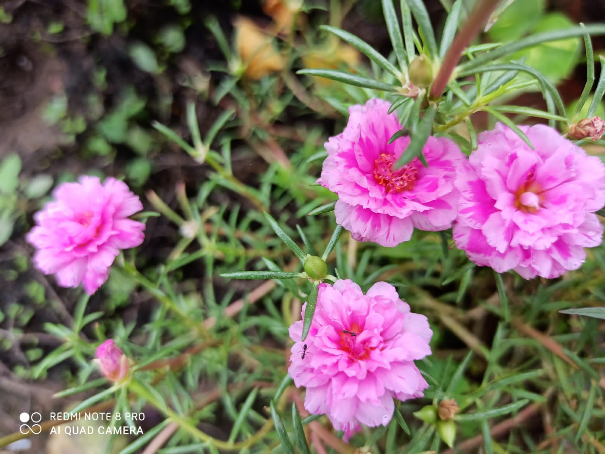

# Alka Kitchen Garden NCR, India 

Anil ji, even during his former tenure as a dedicated senior official government of India, has been into urban farming from years. He has full fledged garden at fourth floor of his house with flowers, vegetables giving him healthy harvest from past many decades. 

In exemplary coordination along with his wife Alka ji, he also guides people for plants, pot farming and creative pottery. 

Based in urban concrete jungle National Capital Region (NCR), India, some of his creativity with plants can be seen in pics here.

## 2021-09-19

Image Source: Anil Tripathi ji

